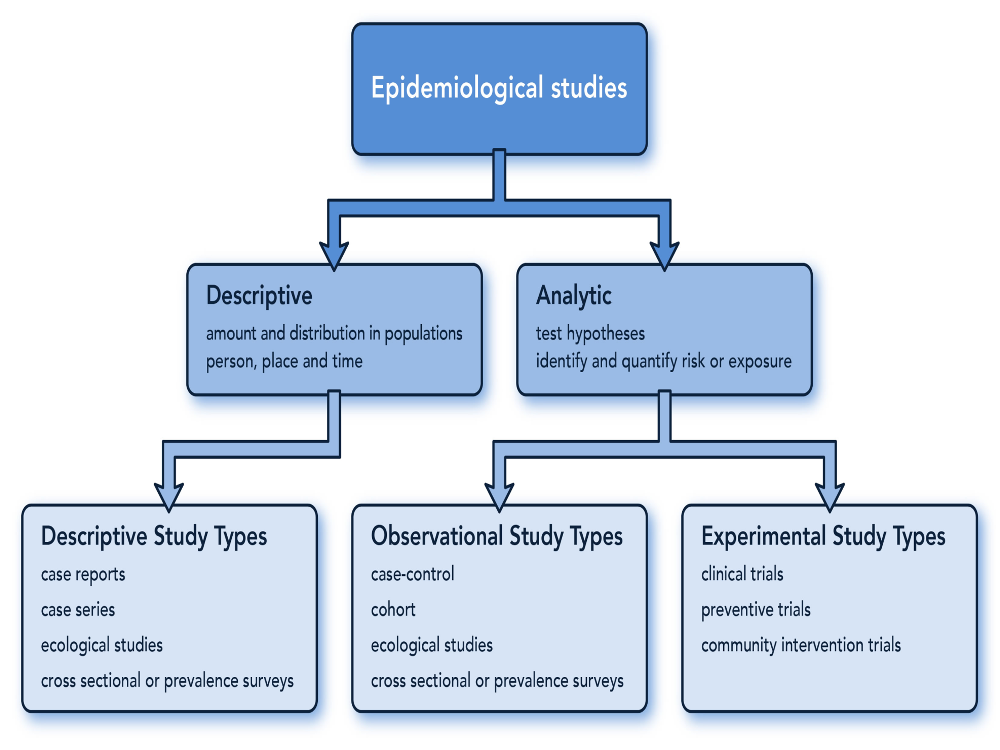
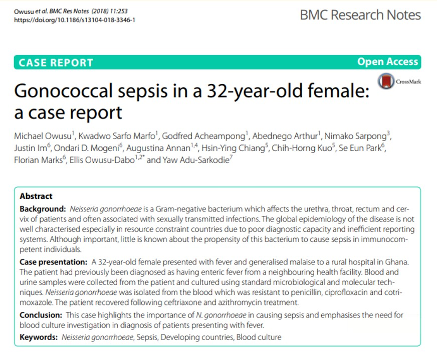
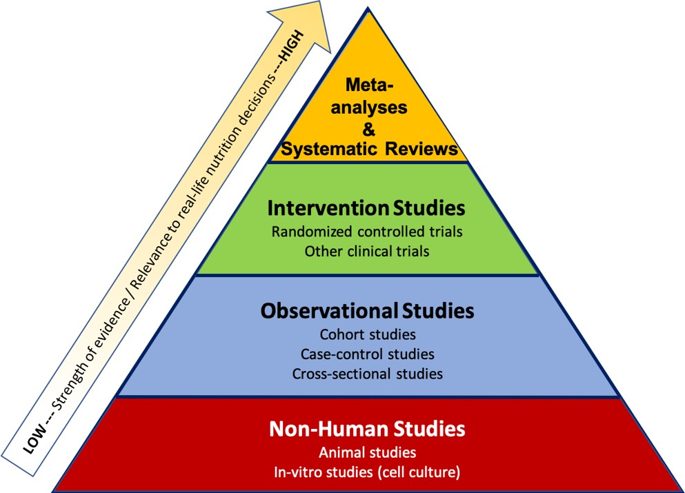

```{r setup, echo=FALSE}
options(htmltools.dir.version = FALSE)

xaringanthemer::style_duo_accent( 
    colors = c(
        blue = "#000080",
        green = "#136f63",
        red = "#f70a26",
        grey = "#6a6a6a"
    ),
    base_font_size = "0.7cm",
    header_h1_font_size = "1.3cm", 
    header_h2_font_size = "1.1cm",
    header_h3_font_size = "0.9cm",
    primary_color = "#5E1224",
    text_color = "#000000",
    inverse_background_color = "#000080",
    inverse_text_color = "#ffffff",
    text_slide_number_color = "#000000",
    inverse_text_shadow = TRUE,
    footnote_font_size = "0.7em",
    footnote_color = NULL,
    footnote_position_bottom = "3px",
)

xaringanExtra::use_logo(
    image_url = "Images//gcps_logo.jpeg",
    width = "90px",
    height = "100px",
    link_url = "https://gcps.edu.gh/",
    exclude_class = NULL
)
xaringanExtra::use_tile_view()
xaringanExtra::use_animate_all(style = "slide_left")
```

#Outline 
.pull-left[
## Observational
- Case Study
- Case Series
- Cross-sectional 
- Case-Control
- Cohort

## Experimenntal
- Randomised **.green[Controlled]** Trials
- Non-Randomised Controlled Trials
]

.pull-right[
## Terminologies to define
- Experimental vrs Observational
- Retrospective vrs. Prospective
- Descriptive vrs. Analytical
- Quantitative vrs. Qualitative
- Primary vrs. Secondary data
]

---
# Quantitative vrs Qualitative methods
- **Quantitative**
    - Involves measurement of outcomes using numerical data under standardized conditions 
    - May be used along the continuum of research
----
- **Qualitative**
    - Concerned with narrative information under less structured conditions that often takes the research context into account
        - Descriptive and exploratory research
        - Purposes: describing conditions, exploring associations, formulating theory, generating hypotheses 

---
class: middle, center


---
#Qualitative Studies
- Seeks to describe how individuals perceive experiences within a social context
- Emphasizes in-depth understanding of human experience and interactions
- Methods include:
    - In-depth interviews
    - Direct observations
    - Examining documents
    - Focus groups
    - Key informant interviews
    - Participant observations
- Data are often participants’ own words and narrative summaries of observed behavior

---
#Qualitative Studies
.pull-left[
**Strengths**
- In depth knowledge of the issues
- Useful for describing complex phenomenon
- Puts local context on the issues
- Easy to evaluate dynamic situations
]

.pull-right[
**Weakness**
- Knowledge may not be generalisable to other locations
- Difficult making quantitative predictions
- Might have lower credibility
- Results easily influenced by researchers opinion
- Complex analytical methods required for data obtained
]

---
# Case Report
.pull-left[
- Description of an individual's 
    - Case condition
    - Response to intervention 
- Can focus on
    - A group
    - Institution
    - School, 
    - Community, 
    - Family, 
    - etc
- Qualitative, quantitative, or both
]

.right[

]

---
# Case Series
- Observations of several similar cases are reported
- Descriptive study: Not designed to address a specific hypothesis
- Key features: Clear, reproducible case definition with a specific focus on place, person and time
- Addresses the 5 Ws quseitons:
    - Who
    - What
    - Why 
    - When 
    - Where
- Often the first approach taken and the resutls guides hypothesis formation

---
# Case Report/Series
- **Strengths**
    - Enables understanding of the totality of an individual’s (or organization, community) experience
    - The in-depth examination of a situation or ‘case’ can lead to discovery of relationships that were not obvious before
    -Useful for generating new hypotheses or for describing new phenomena
- **Weakness**
    - Weaknesses
    - No control group
    - Prone to selection bias and confounding
        - The interaction of environmental and personal characteristics make it weak in internal validity
    - Limited generalizability
    
---
# Cross-sectional Study
- Researcher studies a stratified group of subjects at one point in time
- Draws conclusions by comparing the characteristics of the stratified groups
- Well-suited to describing variables and their distribution patterns
- Can be used for examining associations; determination of which variables are predictors, and which are outcomes depends on the hypothesis:
    - *Does lead paint ingestion cause hyperactivity or does hyperactivity lead to lead paint ingestion?*

---
# Cross-sectional Study - example 
**What is the prevalence of chlamydia in women age 18-35 in Cleveland, and is it associated with the use of oral contraceptives?**

----
- Select a sample of 100 women attending an STD clinic in the city of Cleveland
- Measure the **predictor** and **outcome** variables by taking a history of oral contraceptive use and sending a cervical swab to the lab for chlamydia culture
- A questionnaire may be used to gather information abut oral contraceptive history

---
# Cross-sectional study
**Strengths**
- Fast and inexpensive
- No loss to follow-up (no follow-up)
- Ideal for studying prevalence
- Convenient for examining potential networks of causal links

**Weaknesses:**
- Difficult to establish a causal relationship between predictor and outcome variables 
- Does not establish sequence of events)
- Not practical for studying rare phenomena

---
# Cohort Study
**A group of individuals who do not yet have the outcome of interest are followed together over time to see who develops the condition**
- Participants are interviewed or observed to determine the presence or absence of certain exposures, risks, or characteristics
- May be simply descriptive 
- May identify risk by comparing the incidence of specific outcomes in exposed and not exposed participants

---
# Cohort Study - example
.center[**Objective: To determine whether exercise protects against coronary heart disease (CHD)**]
- Assemble the cohort: 16,936 Harvard alumni were enrolled
- Measure predictor variables: 
    - Administer a questionnaire about activity and other potential risk factors , collected data from college records
- 10 years later, sent a follow-up questionnaire about CHD and collected data about CHD from death certificates

---
#Cohort Study
**Strengths**
- Powerful strategy for defining incidence and investigating potential causes of an outcome before it occurs
- Time sequence strengthens inference that the factor may cause the outcome

**Weaknesses**
- Expensive, many subjects must be studied to observe outcome of interest
- Potential confounders: eg, cigarette smoking might confound the association between exercise and CHD

---
# Case-Control Study
- Generally retrospective
    - Identify groups
        - Cases
        - Controls (matched or unmatched)
    - Look backward in time to find differences in:
        - Predictor variables 
- **Assumption:** Differences in exposure => Different outcomes
- Data collection via:
    - Direct interview
    - Mailed questionnaire
    - Chart review
    - etc
    
---
#Case-Control Study
**Strengths**
- Rare conditions
- Short duration & relatively inexpensive
- High yield of information from relatively few participants
- Useful for generating hypotheses

**Weaknesses**
- Increased susceptibility to bias
    - Separate sampling of cases and controls
    - Retrospective measurement of predictor variables
- No way to estimate the excess risk of exposure
- Only one outcome can be studied

---
#Case-Control Study - Example
.center[**Purpose:** To determine whether there is an association between the use of aspirin and the development of Reye’s syndrome in children.]

- **Draw the sample of cases** – 30 patients who have had Reye’s syndrome
- **Draw the sample of controls** – 60 patients from the much larger population who have had minor viral illnesses without Reye’s syndrome
- **Measure the predictor variable:** Ask patients in both groups about their use of aspirin

---
#Experimental studies
- To compare 2 or more groups by:
    - Randomization 
    - Non-randomization

**Assumption**: 
- The groups differ solely on the basis of what occurs between measurements (ie, intervention)    
- Changes from pretest to posttest can be reasonably attributed to the intervention
- Most basic is the pretest-posttest control group design (randomized controlled trial, RCT)

---
#Experimental studies - Example  
**Objectives:** <br>
Is regular exercise associated with improved depression, functional status, and quality of life of elderly.

**Population:** <br>
Elderly 70yrs and above with depression

**Intervention** <br>
Three times weekly scheduled exercises

**Method** <br>
70 elderly randomized to exercise and non-exercise groups

**Measures:** <br>Pre- and Post-Test evauation of outcome measures. 

---
#Experimental studies
**Strengths**
- Controls the influence of confounding variables
- Randomization eliminates bias
- Blinding the interventions eliminates bias

**Weaknesses**
- Costly in time and money
- Many research questions are not suitable for experimental designs
- Usually reserved for more mature research questions
- Experiments tend to restrict the scope and narrow the study question

---
# Quasi-Experimental studies
- Do not use randomized assignments for comparisons

---
#Systematic Review
.pull-left[
**1. Planning**
- Search for existing reviews & protocols
- Formulate review question
- Develop review protocol
    
**2. Systematic Literature Search**
- Search strategy
- Systematically search databases and literature
- Download citation to a reference manager
]

.pull-right[
**3. Appraisal & synthesis**
- Select studies
- Extract data
- Synthesize data

**4. Reporting findings**
- Writing the reviews
- Publishing
]

---
#Meta-analysis
- **Identify studies**
- **Determine eligibility**
    - Inclusions
    - Exclusions
- **Abstract data from studies**
- **Analyse data using requisite statistical methods**

---
class: middle, center

##Strength of evidence


---
#Summary - Study types
.pull-left[
###Descriptive
- Case study & series
- Cross-sectional study
- Qualitative study

###Exploratory
- Cohort study
- Case control study
]

.pull-right[
###Experimental
- True experimental designs
- Quasi-experimental designs

###Others
- Systematic Review
- Meta-analysis
]

---
class: inverse middle center
<style>
.bye{
    font-size: 3em;
    font-weight: bold;
    /*font-style: italic;*/
    color: white;
}
</style>

.bye[
    Thank you!!! `r emo::ji("smile")`
]

