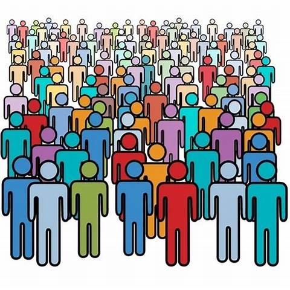

```{r setup, echo=FALSE}
options(htmltools.dir.version = FALSE)

xaringanthemer::style_duo_accent( 
    colors = c(
        blue = "#000080",
        green = "#136f63",
        red = "#f70a26",
        grey = "#6a6a6a"
    ),
    base_font_size = "0.7cm",
    header_h1_font_size = "1.3cm", 
    header_h2_font_size = "1.1cm",
    header_h3_font_size = "0.9cm",
    primary_color = "#5E1224",
    text_color = "#000000",
    inverse_background_color = "#000080",
    inverse_text_color = "#ffffff",
    text_slide_number_color = "#000000",
    inverse_text_shadow = TRUE,
    footnote_font_size = "0.7em",
    footnote_color = NULL,
    footnote_position_bottom = "3px",
)

xaringanExtra::use_logo(
    image_url = "Images//gcps_logo.jpeg",
    width = "90px",
    height = "100px",
    link_url = "https://gcps.edu.gh/",
    exclude_class = NULL
)
xaringanExtra::use_tile_view()
xaringanExtra::use_animate_all(style = "slide_left")
```

# Outline
.pull-left[
### Population
- Target population
- Study population
- Sampling frame
- Sample

### Sample Size
- Determination
- Determinants
]

.pull-right[
### Sampling Methodology
- **Probability Sampling**
    - Simple random sampling
    - Systematic sampling 
    - Stratified sampling
    - etc

- **Non-Probability sampling**
    - Convenience sampling
    - Snowballing
    - etc
]

---
class: center, middle
#Population in research


---
#Population
- **Target population:** Any specified group (usually large) of persons, things, or measurement values, e.g. the study population, the sampled population, the target population.

- **Study population:** This is a subset of a population, whose properties have been, or are to be, generalized to the larger population or set.

- **Sampling:** This is a process of picking a sample from the population.

- **Sample:** Members of the study population who are selected for the study. Should be representative of the target population

---
class: center, middle, inverse
#Sampling in research

---
# Sampling
.pull-left[
##Non-Probability
- Convenience sampling
- Snowballing
- Quota sampling
- Purposive sampling
- Responder driven sampling (RDS)
]

.pull-right[
##Probability
- Simple random sampling
- Systematic sampling 
- Stratified sampling
- Cluster sampling 
- Multistage sampling
]

---
#Simple Random Sampling


---
## Simple Random Sampling
.pull-left[
### Advantages
- Minimal knowledge of group required
- Free from error of classification
- Suitable for data analysis
- Free from bias
- Simple to use
]

.pull-right[
### Disadvantages
- Population should not be dispersed
- Unusable in an heterogeneous
- Lacks use of available knowledge concerning population.
- Need for a well laid out sampling frame.
]

---
# Systematic Random Sampling


---
##Systematic Random Sampling
.pull-left[
###Advantages
- Simple to implement
- Simple to design
- No need for a ssmpling frame
- Good coverage of study area
]

.pull-right[
###Disadvantages
- Might introduce bias
    - Trend
    - Periodicity
]

---
class: center, middle


---
##Stratified Random Sampling
.pull-left[
###Advantages
- All groups included
- Statistical precision increased
]

.pull-right[
###Disadvantages
- Stratat might be difficult to determine
- Sampling error difficult to measure
]

---
class: center, middle


---
class: center, middle


---
#Convieneince sampling
**Collection of data from population that is convieniently avaiable to provide. Also called *"Accidental sampling"*.**
- **Advantages**
    - High participation rate
    - Easy to implement
    
- **Disadvantages**
    - Difficualt to generalise
    - Bias

---
class: center, middle
## Snowballing Sampling 


---
# Bias in sampling
###Definition
Distortions that arise when a sample is not representative of the population from which it was drawn

###Sources
- Poor sampling technique
- Studying volunteers
- Non-response
- Seasonal bias
- “Convenience sampling”

**These should be reduced!**

---
class: center, middle, inverse
# Sample Size

---
# Why bother
- Identify study population
- Draw a sample
- Describe sample (e.g mean)
- Make inferences about the whole population
.center[]

---
##Sample size - how much?
.pull-left[
###Determinants
- Study objectives
- Type of study
- Study design
- Variables to be measured
- Achievability
]

.pull-right[
###Too little
- Not representative enough
- Cannot make reasonable conclusions about population
- Waste of resources
- Ethically improper 

###Too much
- Waste of resources
- Data redundancy
- Ethically improper 
]

---
# Sample size - not one formula fits all!!!

.pull-left[
**Sample size to determine the average systolic blood pressure of KATH workers**
<br> <br>

$$ n = \frac{Z^2 \sigma^2}{E^2} $$
]

.pull-right[
**Sample size required to determine proportion of hypertensives in KATH**
<br>
$$ n = \frac{Z_\frac{1}{\alpha}^2 p (1-p)}{d^2} $$
]
---
#Sample size – Comparing 2 means 
-   $\mu_A$ is the mean in group A
-   $\mu_B$ is the mean in group B
-   $n_A$ is the sample size in first group
-   $n_B$ is the sample size in second group
-   $\kappa = \frac{n_A}{n_B}$ is the matching ratio
-   $\alpha$ is the type I error rate
-   $\beta$ is the type II error

$$n_A=\kappa n_B \;\text{ and }\;
        n_B=\left(1+\frac{1}{\kappa}\right)
            \left(\sigma\frac{z_{1-\alpha/2}+z_{1-\beta}}{\mu_A-\mu_B}\right)^2$$

---
# Case-control study

Using the formulas below by Campbell et al
$$n=\frac{[Z_{1-\alpha/2}\sqrt{2\bar{p}(1-\bar{p})}+Z_{1-\beta}\sqrt{p_A(1-p_A)+p_B(1-p_B)}]^2}{\delta^2}$$
and $$N=\frac{r+1}{2r}\times n$$

- Where: $p_A$ and $p_B$ is the prevalence of the complications in hypertensives and
non-hypertensives respectively.
- $\delta=p_A-p_B$, and $\bar{p}=\frac{(p_A+p_B)}{2}$,
$Z_{1-\alpha/2}=1.96$ and $Z_{1-\beta}=0.84$. $n$

---


---


---


---
# Summary...
.pull-left[
### Population
- Target population
- Study population
- Sampling frame
- Sample

### Sample Size
- Determination
- Determinants
]

.pull-right[
### Sampling Methodology
- **Probabliity Sampling**
    - Simple random sampling
    - Systematic sampling 
    - Stratified sampling
    - etc

- **Non-Probability sampling**
    - Convenience sampling
    - Snowballing
    - etc
]

---
class: inverse middle center
<style>
.bye{
    font-size: 3em;
    font-weight: bold;
    /*font-style: italic;*/
    color: white;
}
</style>

.bye[
    Thank you!!! `r emo::ji("smile")`
]