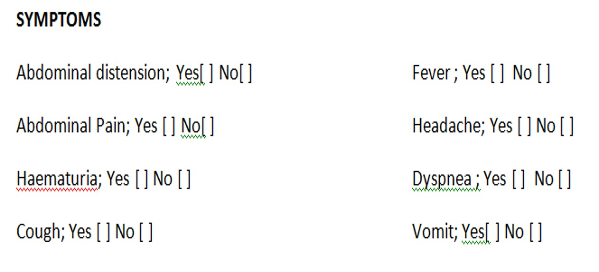
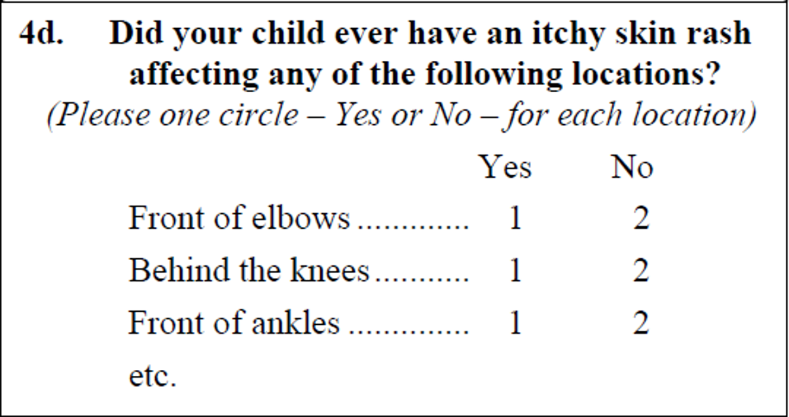

```{r setup, include = FALSE}
library(tidyverse)
library(knitr)
opts_chunk$set(echo = FALSE,
               fig.width = 7.252,
               fig.height = 4,
               dpi = 300)

xaringanExtra::use_tile_view()
xaringanExtra::use_animate_all(style = "fade")
xaringanExtra::use_scribble()
```
class: title-slide, left, bottom

# `r rmarkdown::metadata$title`
----
## **`r rmarkdown::metadata$subtitle`**
### `r rmarkdown::metadata$author`
### `r rmarkdown::metadata$date`

---
# Workshop outline...

----
- Recap of previous workshop
- Formation of groups
- Types of variables
- Designing a questionnaire
- Codebook
- Database design – EpiData
- Data entry for workshop questionnaire
- Visualising entered data 

---
class: center middle 
# Recap of workshop I & other matters…

---
class: center middle 
# Formation of groups of 3

---
class: center middle
# Do we all have <u>.red[EpiData] </u> and <u>.red[Stata]</u> installed and working?

---
class: center middle
.title-text[VARIABLE TYPES]

---
# Variable Types
----
Each variable and the resulting data will be one of two types:
- **Qualitative** (*categorical*) or 
- **Quantitative** (*numerical*)

.center[

]
---
# Qualitative data
----
.pull-left[
- Nominal data
    - The categories are not ordered but simply have names. 
    - Examples include blood group (A, B, AB, and O).

- Binary (dichotomous) data  
    - There are only 2 possible categories for the variable. 
    - E.g Sex (male and female)
]
.pull-right[
- Ordinal data
    - the categories are ordered in some way. 
    - Examples include disease staging systems - Advanced, Moderate, Mild, none
]

---
Quantitative (*Numeric*)
----
.pull-left[
- Continuous 
    - Takes on any precision. 
    - Has no limitation to the values. 
    - E.g : Age of a person
]

.pull-right[
- Discrete  
    - Takes on certain specific (usually) whole numbers. 
    - Often a representation of a count of events. 
    - E.g. Number of cars
]
---
# Other data types
----
.pull-left[
- Percentages
    - Usually  stored as a quantitative but actually a fraction
    - 24% of 200 is not the same as 24% of 300.
    - E.g. Patient’s FEV1 increase by 24% following treatment with a new drug.
]

.pull-right[
- Ratios or quotients
    - Ratio of two variables
    - E.g incidence ratio, BMI

- Scores
    - Arbitrary values 
    - Not very meaningful
    - E.g: Pain score
]

---
# Group Work
----
- Be in your groups
- Give five examples each of the following variables:
    - Numeric 
        - Discrete numeric
        - Continuous numeric
    - Categorical data
        - Nominal
        - Ordinal 
    - Binary
    - Date and/or time
```{r}
library(countdown)
countdown(font_size = "100px",
  minutes = 10, 
  seconds = 0,
  color_border              = "red",
  color_text                = "red",
)
```

---
class: middle center
.activity[
Presentation of Group work
]

```{r}
countdown(minutes=10, seconds=0)
```
---

# Dependent & Independent variables
----
- **Independent** (predictor) variable 
    - Potentially influences, affects or predicts another variable
    - E.g: How age influences income make age the independent variable

- **Dependent** (predicted) variable 
    - Potentially predicted, influenced and affected by another variable
    - E.g: How age influences income make income the dependent variable

---
class: middle center
.activity[
Can we have volunteers  tell us about their .red[TOPIC], .red[INDEPENDENT] and .red[DEPENDENT] variables to be collected?
]

```{r}
countdown(minutes=10, seconds=0)
```

---
class: middle center
.title-text[Questionnaire Designing]

---
class: center middle
# Individual Questionnaire designing activity

---
# Dummy Questionnaire 
----
.activity[Mr. X is conducting a research. The variables below are to be determined in his study. He has approached you to help him design a questionnaire.  Please create a questionnaire to seek information for the following variables. You have .red[<u>15 minutes.</u>]]

---
# Variables
----
.pull-left[
- Date  and time of interview
- Date of birth
- Sex
- Age
- BMI
- Blood pressure
    - Systolic
    - Diastolic
- Presence of the following: 
    - fever, 
    - cough, 
    - vomiting
]
.pull-right[
- Marital status
- Educational level
- Is the person a known hypertensive?
- If yes for how long has he/she been?
- Any comments?
]

```{r}
countdown(minutes=15, seconds=0)
```

---
#Questionnaire designing
----
.left-column[
Outline
]
.right-column[
- Data collecting tools
- Framing a good question in the questionnaire
- What question can I ask
- Sequencing of questions
- Response categories
- Importance of question numbers
]

---
# Questionnaire designing
----
.left-column[
Data collection tools


]

.right-column[
- Face-to-face interviews 
    - Case Report Form
    - Data sheet
    - Phone or tablet (electronic)
    - Questionnaire (Paper)
- Telephone interviews
- Self-completion questionnaires
    - Mail-in questionnaires
- Focus group discussion

]

---
# Questionnaire designing
----
.left-column[
Layout
]
.right-column[
- Consider the respondent
- Should be 
    - Simple
    - Clear
    - No doubt how to fill in.
- No processing of information to be recorded
]

---
# Question to a pregnant woman
----
###What is your estimated gestational age?

Is this
1. Simple?
1. Clear?
1. Appropriate?

---
#Question
----
.center[
### Educational level
Primary &emsp; &emsp;    .line[] <br>
Secondary &emsp;  .line[] <br>
Tertiary &emsp; &emsp;   .line[] <br>
None &emsp; &emsp; &emsp;        .line[] <br>
]
---
# Is this right?
----
### Do you have intermittent fever?
&emsp;  Yes &emsp; .line[] <br>
&emsp;  No  &emsp; .line[] <br>


--

### If yes, what is the nature of the fever?
&emsp;  Low Grade &emsp; .line[] <br>
&emsp;  Ligh Grade  &emsp; .line[] <br>

---
# Leading question?
----
### How would you describe the taste of our icecream?
&emsp; \[ &nbsp; &nbsp; \] &emsp; Superb <br>
&emsp; \[ &nbsp; &nbsp; \] &emsp; Excellent <br>
&emsp; \[ &nbsp; &nbsp; \] &emsp; Great <br>
&emsp; \[ &nbsp; &nbsp; \] &emsp; Pretty good <br>
&emsp; \[ &nbsp; &nbsp; \] &emsp; OK <br>

---
# Leading question?
----
### The response category should allow the respondents to like or disike the taste. A much better range would be
&emsp; \[ &nbsp; &nbsp; \] &emsp; I liked it very much <br>
&emsp; \[ &nbsp; &nbsp; \] &emsp; i quite liked it <br>
&emsp; \[ &nbsp; &nbsp; \] &emsp; i neither liked nor disliked it <br>
&emsp; \[ &nbsp; &nbsp; \] &emsp; I did not like it <br>
&emsp; \[ &nbsp; &nbsp; \] &emsp; It was awful <br>

---
# Close ended question?
----
### how would you descrive the taste of our new icecream?
&emsp; \[ &nbsp; &nbsp; \] &emsp; I liked it very much <br>
&emsp; \[ &nbsp; &nbsp; \] &emsp; I quite liked it <br>
&emsp; \[ &nbsp; &nbsp; \] &emsp; I neither liked nor disliked it <br>
&emsp; \[ &nbsp; &nbsp; \] &emsp; I did not like it <br>
&emsp; \[ &nbsp; &nbsp; \] &emsp; It was awful <br>

---
# Open ended question?
----
- Leave adequate space
- Re-categorise in the  codebook
- Can be challenging
--

### Question: _How do you get to work?_
There is not reponse category but rather a box to enter free text response. The subject may now qualify this answer with...
>"Well, on a Monday I take the train. On Tuesday and Wednesday I get a lift, on Thursday I drive myself to work and on friday I work from home. So, I guess you could say I walk as my home office is in the summer house ae the end of the garden"

---
# Adding "Others" category
----
### How do you usually communicate with your friends?
&emsp; \[ 1 \] &emsp; By phone <br>
&emsp; \[ 2 \] &emsp; Text (SMS) <br>
&emsp; \[ 3 \] &emsp; email <br>
&emsp; \[ 4 \] &emsp; Letter <br>
&emsp; \[ 5 \] &emsp; Others, please specify:............................ <br>

---
# Layout of the questionnaire
----
- Must have  unique number (Study ID)
- Must have titles on each page
- Short description of questionnaire 
- Must have page numbers
- Must have version number
- Well spaced
- Preferably each question in a box
- Font
    - Questions in Bold
    - Response category in normal 
    - Instruction in Italics

---
# Layout of the questionnaire -2 
----
- Questions must preferably be numbered
- Response answers in a box - no lines
- Adequate amount of space
- Options on the right
- Question on the left

---
# Layout
----
Is there any thing wrong with this layout? 


---
# Layout
----
Is there any thing wrong with this layout? 
.center[

]

---
# Layout
----
.left[

]
--
.right[

]

---
.center[

]

---
.center[

]

---
# Codes
----
### Always use numeric codes
.pull-left[
- Easier to enter on CRF
- Faster to enter in database
- Easier for most software to analyze
]
.pull-right[

]

---
# Codes - Example
----


---
# Codes - Ordinal Scale
----


---
# Codes - Example
----


---
# Content of the questionnaire
----
.pull-left[
### What question can I ask?
- Any appropriate question
- Must be relevant to the study
- Not unnecessarily intrusive
- Intrusive questions must be explained beforehand
]

--

.pull-right[
###The sequence of questions
- Related questions should be neighbours
- Start with 'neutral' questions
- Put “interesting” question in the middle
- Leave sensitive questions to the end of the interview
]

---
# Content of the questionnaire
----
### The phrasing of questions
- Use understandable language
- Avoid medical or bureaucratic jargon.
- Sentences should be short and easy to read
- Avoid confusing term E.g: _"What is your level of education"_

---
# Content of the questionnaire
----
### Phrasing – too little text!


---
# Content of the questionnaire
----
### Response categories should be:
- Exhaustive 
- Mutually exclusive

---
# Content of the questionnaire
----
### Response categories - What is/are wrong?


---
# Content of the questionnaire
----
### Response categories - What is/are wrong?


---
# Content of the questionnaire
----
### Response categories - What is/are wrong?


---
# Content of the questionnaire
----
### Response categories


---
# Collect "raw" data
----
.center[]

---
# Collect "raw" data
----
.center[]

---
# Collect "raw" data
----
.center[]

---
# Questiannaire - General outlay to consider
----
- Main topics related to objectives
- Dependent variables
- Independent variables
- As much as possible open-ended questions first close ended last
- Section by section – Group related questions
- No unnecessary branching
- Interesting questions in the middle 3rd of questionnaire
- Always number questions
- Avoid splitting answer categories across two pages
- Add questions numbers, especially in large CRF. E.g q1a, q3c, Q2sex, q7time

---
# Conclusion
----
### A well designed questionnaire makes it
- Easy for respondent
- Easy for researcher
- Easy for statistician

---
class: center middle
.thank-you[Thank you!!!]

---
class: center middle
# Who thinks his/her questionnaire was perfect? 
--
<br>
### Any volunteer  to discuss his/her questionnaire?

---
class: center middle
# Review the questionnaire given to you and comment accordingly.


```{r}
countdown(minutes=10, seconds=0)
```

---
class: center middle
# Fill out the questionnaire

---
class: center middle
.title-text[Codebook]

---
# Codebook
- Link between data questionnaire and data entry screen
- Done with questionnaire and before data entry screen
- Facilitates data analysis
- Parts
    - Variable name
    - Source
    - Meaning
    - Codes, Valid range
    - Format
    
---
# Codebook - Example
.center[]

---
class: bottom left
# Codebook format
<table>
    <tr>
        <th>Variable name</th>
        <th>Source</th>
        <th>Meaning</th>
        <th>Codes, Valid range</th>
        <th>Format</th>
    </tr>
    <tr>
        <td>studyid</td>
        <td>Q1. Study ID</td>
        <td>Study ID</td>
        <td>1 to 300</td>
        <td>F3.0</td>
    </tr>
    <tr>
        <td>sex</td>
        <td>Q2. Sex of patient</td>
        <td>Sex of patient</td>
        <td>
            0 = Female <br> 
            1 = Male <br>
            8 = Unknown <br>
            9 = Missing
        </td>
        <td>F1.0</td>
    </tr>
    <tr>
        <td>birthyear</td>
        <td>Q3. Whay is your year of birth</td>
        <td>Year of birth</td>
        <td>
            1950 - 2023 <br>
            -1 = No Response
        </td>
        <td>F4.0</td>
    </tr>
    <tr>
        <td>schcomp</td>
        <td>Q4. What is your highest level of school completed?</td>
        <td>Educational level completed</td>
        <td>
            0 = None <br>
            1 = Primary/JSS <br>
            2 = SHS <br>
            3 = Vocational <br>
            4 = Tertiary
        </td>
        <td>F1.0</td>
    </tr>
    <tr>
        <td>yearexp</td>
        <td>Q5. Number of years of experience</td>
        <td>Years of experience</td>
        <td>
            0 - 25 <br>
            -1 = Don't Know <br>
            -2 = Not applicable
        </td>
        <td>F2.0</td>
    </tr>
    
</table>

---
#Database front-end
----
.center[]

---
#Database back-end
----
.center[]

---
#Database front-end
----
.center[]

---
#Database back-end
----
.center[]

---
#Variable names
----
- Used for data cleaning and analysis
- Not more than 8 characters
- Alpha –numeric  i.e. a-z and 0-9  and underscore (name_1)
- Avoid special characters (&^%#)
- Never begin with a number
- Remember they are case sensitive
    - Boy ≠ boy

---
#Variable names
----
- Use lowercase variable
- Should preferably be meaningful e.g. 
    - sex
    - age
    - weight
- May need to qualify many variables with similar names:  
    - q7a
    - q9b
- Three different dates of interview can be named as:
    - date1
    - date2 
    - date3

---
# Meaning
----
- Short phrase
- May be similar to a short question on questionnaire
- Describes the variable
- E.g.

<table style="width:60%">
    <tr>
        <th>Name</th>
        <th>Meaning</th>
    </tr>
    <tr>
        <td>sex</td>
        <td>Sex of respondent</td>
    </tr>
    <tr>
        <td>vomit_2</td>
        <td>Vomiting present in patient on second day</td>
    </tr>
    <tr>
        <td>diar_1</td>
        <td>Diarrhoea present in patient on day 1</td>
    </tr>
</table>

---
# Meaning
----
.center[]

---
#Codes & valid range
----
.pull-left[
##Codes
- Decide how to code “Missing”
- Types of “missing” 

<table style="width:80%">
    <tr>
        <td>Not applicable</td>
        <td>-1, 888 etc</td>
    </tr>
    <tr>
        <td>No response</td>
        <td>-2, 999</td>
    </tr>
    <tr>
        <td>Don’t know</td>
        <td>-3, 777</td>
    </tr>
    <tr>
        <td>Variable missing</td>
        <td>999</td>
    </tr>
</table>
]

.pull-right[
## Valid range
- Should be reasonable and comprehensive

<table style="width:110%">
    <tr>
        <td>Age (yrs) of children</td>
        <td>Range: 	0 to 12 and 99</td>
    </tr>
    <tr>
        <td>Sex</td>
        <td>Range: 	0,1,8,9</td>
    </tr>
    <tr>
        <td>Hemoglobin</td>
        <td>Range: 1-20, 88, 99</td>
    </tr>
</table>
]

---
# Format
----
States the format of the variable

E.g.

<table style="width:80%">
    <tr>
        <td>F2.0</td>
        <td>two numbers with no decimal	eg. 22, 31</td>
    </tr>
    <tr>
        <td>F3.1</td>
        <td>three numbers with 1 decimal 	eg.  13.6,   56.1</td>
    </tr>
    <tr>
        <td>Fdd/mm/yyyy</td>
        <td>Date with day/mo/year 	eg. 12/06/2010</td>
    </tr>
    <tr>
        <td>Fmm/dd/yy</td>
        <td>Date with month/day/year	eg. 03/24/10</td>
    </tr>
</table>

---
class: bottom left
# Codebook
<table id="final-table">
    <tr>
        <th>Variable name</th>
        <th>Source</th>
        <th>Meaning</th>
        <th>Codes, Valid range</th>
        <th>Format</th>
    </tr>
    <tr>
        <td>studyid</td>
        <td>Q1. Study ID</td>
        <td>Study ID</td>
        <td>1 to 300</td>
        <td>F3.0</td>
    </tr>
    <tr>
        <td>sex</td>
        <td>Q2. Sex of patient</td>
        <td>Sex of patient</td>
        <td>
            0 = Female <br> 
            1 = Male <br>
            8 = Unknown <br>
            9 = Missing
        </td>
        <td>F1.0</td>
    </tr>
    <tr>
        <td>birthyear</td>
        <td>Q3. Whay is your year of birth</td>
        <td>Year of birth</td>
        <td>
            1950 - 2023 <br>
            -1 = No Response
        </td>
        <td>F4.0</td>
    </tr>
    <tr>
        <td>schcomp</td>
        <td>Q4. What is your highest level of school completed?</td>
        <td>Educational level completed</td>
        <td>
            0 = None <br>
            1 = Primary/JSS <br>
            2 = SHS <br>
            3 = Vocational <br>
            4 = Tertiary
        </td>
        <td>F1.0</td>
    </tr>
    <tr>
        <td>yearexp</td>
        <td>Q5. Number of years of experience</td>
        <td>Years of experience</td>
        <td>
            0 - 25 <br>
            -1 = Don't Know <br>
            -2 = Not applicable
        </td>
        <td>F2.0</td>
    </tr>
    
</table>

---
#Conclusion
----
## Codebook
- Essential part of a questionnaire
- Divided into 
    - Variable names
    - Meaning
    - Range
    - Codes
    - Format 

---
class: center middle
.thank-you[Thank you!!!]

---
class: middle center
.activity[
Create a CODEBOOK for the questionnaire
]

```{r}
countdown(minutes=10, seconds=0)
```

---
class: middle center
.activity[
Can we have 3 volunteers to present their codebook?
]

```{r}
countdown(minutes=10, seconds=0)
```

---
class: center middle
.title-text[Electronic database designing: EpiData<sup>&reg;</sup>]

---
# EpiData
----
.left-column[
Steps...
]

.right-column[
1. Downloading
1. Installation
1. Customization of the software
1. Introduction to the user interface
1. Creation of data entry fields
1. Entering data
1. Visualizing the entered data
1. Exporting data to Excel
]

