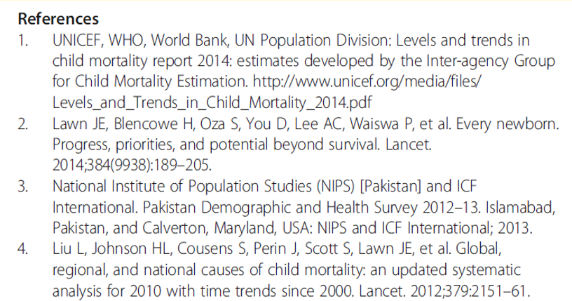
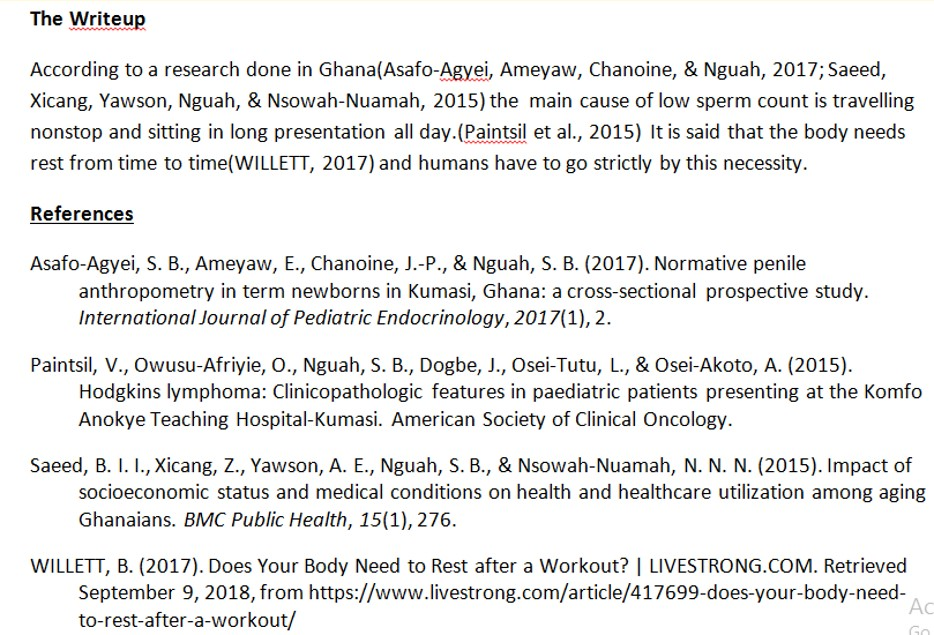
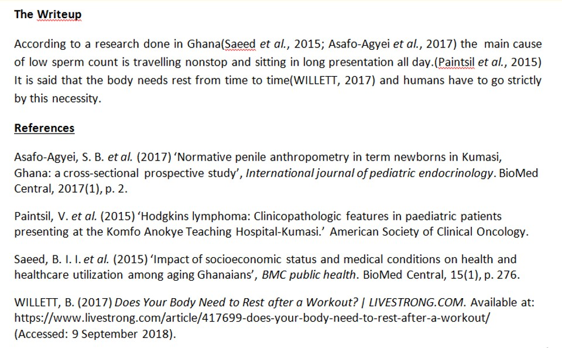
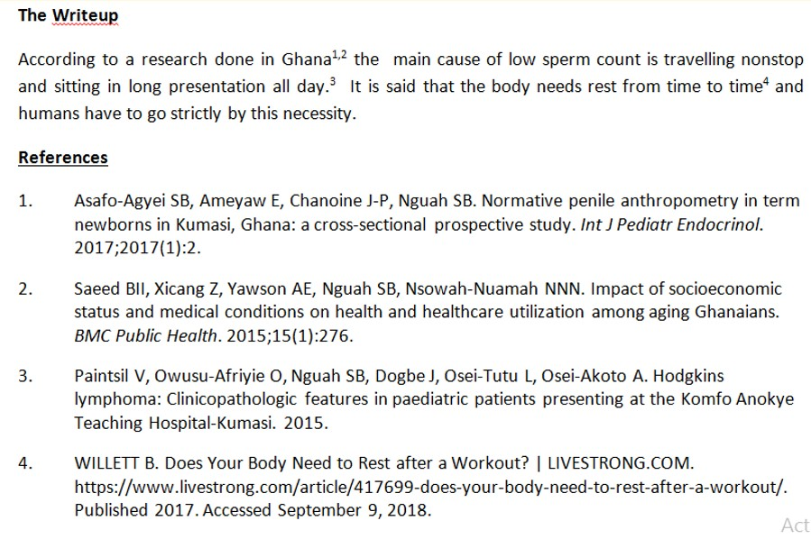
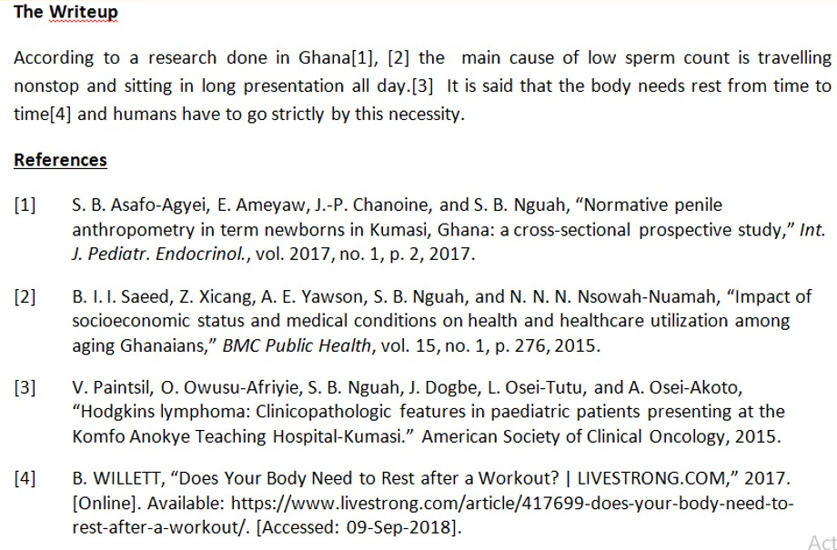
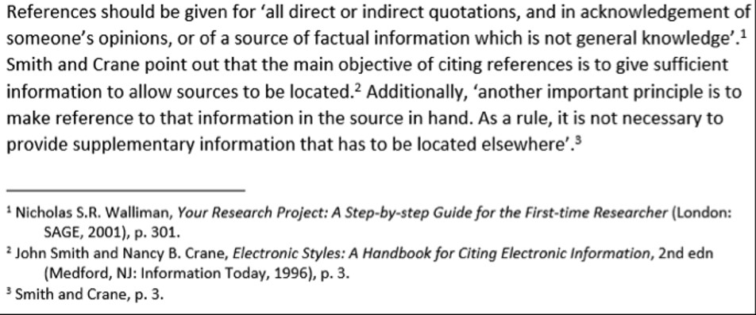
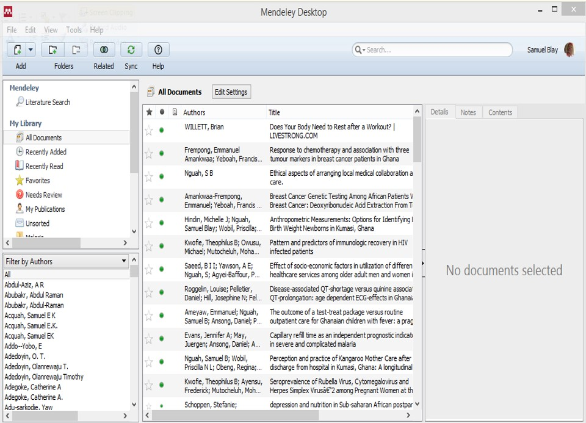
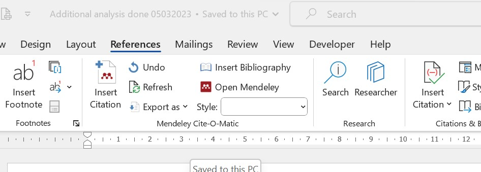

```{r setup, echo=FALSE, message=F, warning=F}
options(htmltools.dir.version = FALSE)
library(tidyverse)

xaringanthemer::style_duo_accent(
    text_bold_color = "#000000",
    colors = c(
        blue = "#000080",
        green = "#136f63",
        red = "#f70a26",
        grey = "#6a6a6a"
    ),
    base_font_size = "0.7cm",
    header_h1_font_size = "1.3cm", 
    header_h2_font_size = "1.1cm",
    header_h3_font_size = "0.9cm",
    primary_color = "#5E1224",
    text_color = "#000000",
    inverse_background_color = "#000080",
    inverse_text_color = "#ffffff",
    text_slide_number_color = "#000000",
    inverse_text_shadow = TRUE,
    footnote_font_size = "0.7em",
    footnote_color = NULL,
    footnote_position_bottom = "3px",
    
)

xaringanExtra::use_logo(
    image_url = "Images//gcps_logo.jpeg",
    width = "90px",
    height = "100px",
    link_url = "https://gcps.edu.gh/",
    exclude_class = NULL
)
xaringanExtra::use_tile_view()
xaringanExtra::use_animate_all(style = "slide_left")
```

<style>
.bye{
    font-size: 3em;
    font-weight: bold;
    /*font-style: italic;*/
    color: white;
}

.indent{
    padding-left: 50px;
    padding-right: 50px;
}

.q{
    font-family: Arial;
    font-size: 1.4em;
    color: black;
    background-color: rgba(0, 0, 255, 0.05);
    border-style: ridge;
    padding-left: 20px;
    padding-right: 20px;
    padding-top: 0px;
    padding-bottom: 0px;
    font-weight: bold;
}
</style>


.left-column[
# Outline
]

.right-column[
- Definition of citation, reference and bibliography
- Why do we reference
- What should I site in my write-up
- Quotes, paraphrasing and summaries
- Positioning references
- Different styles of reference
- Referencing software and website
- Mendeley software
]

---
class: center, middle
background-image: url("Images/akufo_addo_plagiarism.jpg") 
background-size: cover

---
# Why do we reference?
- Acknowledging the contribution of others to your work
- Give credit to others before you
- Distinguish between your idea and other’s
- Evidence to support your assertions
- Intellectual property
- Show off
- Avoid plagiarism (and criticism by our political opponents) `r emo::ji("smile")`

---
# What is a Citation?
.red[
.center[
_These are small pieces of text included in the body of a work which point to more detailed information in the References._
]
]

<br>

“According to a research done in Ghana .red[[1,2]] the  main……”

<br>

“According to a research done in Ghana(.red[Asafo-Agyei et al. 2017; Saeed et al. 2015]) the  main……”

---
# What are references?

- List of items referred to in the citation
- Details sufficient to enable the reader to locate a copy of the text referred to
.center[

]

---
# Bibliography
- Similar to reference but contains other items <u>**not directly**</u> referred to in text of writing
- Usually included for suggested further readings
- Listed in alphabetical style
- Details sufficient to enable the reader to locate a copy of the text referred to

---
# What should you reference?
.pull-left[
- Journal articles
- Books
- Newspapers
- Magazines
- Pamphlets 
- Brochures
- Films
- Documentaries
- Television programs 
- Advertisements
- Definition of terms
]

.pull-right[
- Websites 
- Other electronic resources
- Letters
- Emails
- Online discussion forums
- Personal interviews
- Speeches
- Diagrams, tables, illustrations, charts or pictures.
- Others

]

---
# What not to reference
- Own experience, observation, thoughts, comments or conclusions.
- Offering your own analysis
- Using 'common knowledge' or folklore e.g:
    - "WHO’s primary role is to direct international health within the United Nations' system"
    - Kweku Ananse stories
- When using generally accepted facts or information 

---
background-image: url("Images/common_knowledge_pix.jpg")
background-position: bottom right
background-size: 45%, 45%

# What is common knowledge
- You must know it before you started the research
- Must be know by most readers if not all
- Usually locality or group specific
- Consider other readers of your work to conclude
- When in doubt CITE!!!!

---
.left-column[
# Quotes
]

.right-column[
- Use exact words even if wrongly spelt!
- Avoid long quotation if possible
- Short quote format
    - In quotation marks
    - Acknowledgement included in text

__Example:__

.center[
*According to Serwaa (2017) “The length of a baby is always proportional to his or her weight”.*
]
]

---
<style> 

</style>

.left-column[
# Quotes
]

.right-column[
**Longer quotes**
- Separate from text by a line or two
- Usually indent
- No quotation marks
- Citation not in quotation

**Example** <br>
There are many definitions given to eating disorders but according to Osei:

.indent[
The eagerness of a person’s hunger pangs determines the amount of food eaten. This makes him a heavy eater if he eats all the portions served to him. He becomes full and does not want to eat again soon. Eating then is good for him.
]
(Osei, 2013)

]

---
.left-column[
# Quotes
]

.right-column[
- Leaving out a portion of a quote by using three dots with a space on either side

**Example**

The World Health Organization in its effort to help with the Ebola outbreak says:

>WHO, together with partners, has developed technical guidance and training materials .red[...] in accordance with the IHR (2005) core capacities requirements.

(WHO, 2017)

]

---
.left-column[
# Quotes
]

.right-column[
- Addition to a quote
    - Use square [---] brackets inside the quote
    - This shows your comment, explanation
    - [sic] shows your accuracy of transcription but an error in the original
    
>“There are many [.red[researchers]] who are not here.”

- Use of italics indicates your emphasis of words

>"WHO, together with partners, has developed technical guidance and training materials that can be used by countries to further strengthen their capacities to prepare and respond to disease .red[*outbreaks*], including Ebola virus disease, in accordance with the IHR (2005) core capacities requirements."

]

---
# Paraphrasing or summarizing

- Start with your own text
- Isolate the main ideas and elaborate/explain
- Should be shorter than original phrase
- Remember to site original source

**Example**

>Numerous studies in developing countries have used causes of death based on medical records as the "gold standard" [7, 24-26]

---
# Exercise
Where do we position the reference(s) in the paragraph below?

<style>

</style>

.q[
Most researchers agree that it is inappropriate to attempt to isolate a single main cause of an accident. However, earlier motor vehicle crash studies demonstrated that about 90% of all accidents could be attributed to road user characteristics. Hence, road user behavior is often examined for compliance with existing traffic rules and regulations. “Speed Kills” has been used for many years as an educational slogan to drive at reasonable speeds.
]

---
# Answer
.q[Most researchers agree that it is inappropriate to attempt to isolate a single main cause of an accident.red[(ref)]. However, earlier motor vehicle crash studies demonstrated that about 90% of all accidents could be attributed to road user characteristics .red[(ref)]. Hence, road user behavior is often examined for compliance with existing traffic rules and regulations .red[(ref)]. “Speed Kills” has been used for many years as an educational slogan to drive at reasonable speeds .red[(???)].
]

---
# Format of referencing

- Always acknowledged within the body of the text

- Reference exactly what is in original text!!!

- Compile the list at the bottom of the page or end of write-up as
    - Reference List 
    - List of Works Consulted 
    - Bibliography

- All details about source should be included in the list

---
class: center, middle
background-image: url("Images/ref_example_1.jpg") 
background-size: 80%

---
#Referencing styles
.pull-left[
## Parenthetical (Author-Date)
- American Psychological Association
- Harvard
- Chicago Author-Date
- Modern Language Association

## Footnote
- Chicago Footnote
- Turabian Note Style
]

.pull-right[
## Numbering
- Vancouver
- American institute of Physics
- American Medical Association
- IEEE (Institute of Elctectrical and Electronice engineers)
]

---
# Parenthetical referencing
.pull-left[
## Harvard
- Name of the author(s)
- Year published
- Title
- City published
- Publisher
- Pages used
]

.pull-right[
## APA
- Author
- Date content was published
- Title of content
- Publication information. This can be the website you got it from or the journal or book's publication information.
- Newspaper, magazines, articles: Treat the organisation like an author e.g (WHO, 2018)
]

---
# Parenthetical referencing - Website
- Use author and publication date or latest update 
- Unknown author?
    - Treat organisation as author
- Organisation unknown?
    - Use title of the web page as author
- Site not dated?
    - use ‘n.d.’ for ‘no date’
- In reference list include 
    - Date site accessed
    - Author &, date
    - Title of website and 
    - url.

---
.left-column[
#APA
]

.right-column[

]

---
.left-column[
#Havard
- Name of the author(s)
- Year published
- Title
- City published
- Publisher
- Pages used

]

.right-column[

]

---
## Numerical referencing
- Citations appear in the same places as parenthetical version 
- Numbers used instead of author’s name and date of publication 
- Numbers could be written 
    - Raw (superscript)
    - Square brackets
    - Normal brackets

---
.left-column[
#American Medical Association
]

.right-column[

]

---
.left-column[
#IEEE style
]

.right-column[

]

---
# Footnote referencing style 


---
# Reference list
.pull-left[
- List of all cited references in the document
- The organisation depends of referencing style
- Parenthetical 
    - Listed in alphabetical order 
    - Other arrangement are style and publisher specific
- Numerical
    - List generated in order of appearance in document

]

.pull-right[
- Generally it should contain
    - Authors (family names and at least initials)
    - Journal article, chapter or conference paper
    - Name of journal, book, conference, etc.
    - Publication date
    - Volume number (for journals)
    - Editor,  publisher,  place of publication (for books)
    - Page numbers (of article or book chapter )

]

---
.left-column[
#Numerical List
]

.right-column[

]

---
.left-column[
#Parenthetical List
]

.right-column[

]

---
# The solution...
- Computers are far smarter at referencing than us so lets use them
- Online reference generators
    - Usually creates only one citation at time
    - Have very limited citation styles 
    - Not recommended for more than 3 references
- Software
    - A number of them
    - Offline  vrs Online
    - Free vrs commercial

---
background-image: url(Images/mendeley_logo.png)
background-position: bottom right
# Mendeley
- Preferred software for this workshop
- Free reference manager, networking and document organising software
- Runs on
    - Windows (desktop version)
    - macOS 
    - Linux. 
- App on Android
- App on iOS
- Mendeley Web (online social network for researchers)

---
.left-column[
# Mendeley library
]
.right-column[
- Add files to library
    - Import references in the format of
        - BibTex
        - Zotero
        - Endnote
        - Research information system (.ris) 
- PDFs (automatic .pdf metadata extraction)
- Automatic citation extraction form compatible webpages and databases
- Full-text search across papers and databases (PubMed, Google Scholar, Arxiv, etc)
- Smart filtering, tagging and automatic PDF file renaming
- PDF viewer with sticky notes, text highlighting and full-screen reading.
- Back-up and synchronization across multiple computers and devices
]

---
.left-column[
#Mendeley Desktop Library
]

.right-column[

]

---
# Citations
- Citations and bibliographies (needs installation of plugins)
    - Microsoft Word
    - OpenOffice.org
    - LibreOffice.
- Citation style
    - Both parenthetical and numerical styles 
    - Easily change form one form to another
- Exports citation as
    - BibTex
    - Zotero
    - Endnote
    - Research information system (.ris) 
---
class: middle, center
.left-column[
#Mendeley Word Plugin
]
.right-column[
 <br>


]

---
.left-column[
# Summary
]
.right-column[
- Definition of citation, reference and bibliography
- Why do we reference
- What should I site in my write-up
- Quotes, paraphrasing and summaries
- Positioning references
- Different styles of reference
- Referencing software and website
- Mendeley software
]


---
class: inverse middle center

.bye[
    Thank you!`r emo::ji("smile")`
]